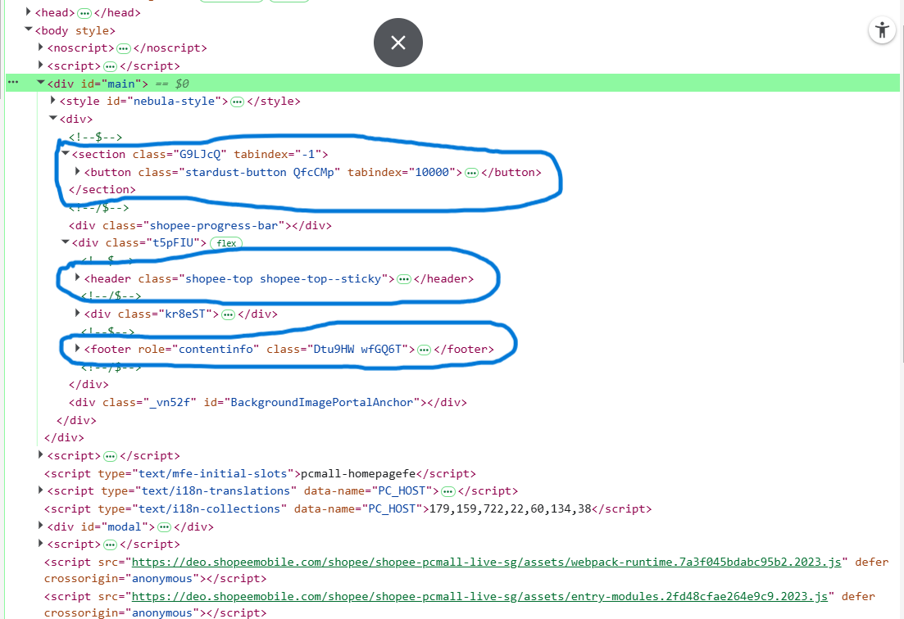

Câu A1 (5đ) — HTTP & Browser  

#### ****I. Khi gõ https://shopee.vn vào trình duyệt và nhấn Enter, các bước xảy ra (từ DNS lookup đến render).****
**1. DNS lookup**  
Trình duyệt hỏi DNS để chuyển shopee.vn → địa chỉ IP server.  
**2. Thiết lập kết nối TCP**  
Trình duyệt tạo kết nối tới server qua port 443 (HTTPS).  
**3. Bắt tay TLS (HTTPS)**  
Xác thực chứng chỉ, thiết lập mã hóa.  
**4. Gửi HTTP Request**  
Trình duyệt gửi request (GET /) lên server.  
**5. Server xử lý & trả Response**  
Server trả về HTML (kèm status code như 200 OK).  
**6. Trình duyệt parse HTML**  
Tạo DOM, phát hiện thêm tài nguyên (CSS, JS, ảnh…).  
**7. Tải tài nguyên phụ**  
Gửi thêm nhiều request để lấy CSS, JS, images.  
**8. Render trang**  
Kết hợp DOM + CSS → layout → paint → hiển thị trang.

#### II.Tab Network trong Chrome DevTools hiển thị gì?
Tab Network cho thấy toàn bộ hoạt động mạng của trang web:
- Danh sách tất cả request (HTML, CSS, JS, ảnh…)  
- Status Code (200, 404, 500…)  
- Time (thời gian tải từng request)  
- Waterfall (timeline tải)  
- Headers (request/response)  
- Size dữ liệu  
- Method (GET, POST…)  
**Ảnh chụp trang web:** 

Câu A2 (5đ) — Semantic HTML  
**Các lỗi semantic (ít nhất 4 lỗi)**

**Lỗi 1:** Dùng "div" thay cho thẻ semantic
header, menu, main, footer đều dùng "div"  
→ Google không hiểu đâu là header, nội dung chính, footer

**Lỗi 2: Menu không dùng danh sách nav + ul**  
Menu đang là nhiều "div"
→ Không đúng cấu trúc điều hướng

**Lỗi 3: Tiêu đề sản phẩm không dùng heading**  
"iPhone 16 Pro" dùng "div class="title"  
→ Phải là "h1", "h2" để Google hiểu nội dung quan trọng

**Lỗi 4: Ảnh không có alt**  
"img src="iphone.jpg"  
→ Thiếu alt → SEO rất kém (Google không hiểu ảnh)

Câu A3 (5đ) — Block vs Inline   
**Kết quả hiển thị của đoạn code HTML:**   
+------------------+    
| Hộp 1            |    
+------------------+

Text A Text B

+------------------+    
| Hộp 2            |    
+------------------+

Text C Text D

+------------------+    
| Hộp 3            |    
+------------------+

**Giải thích**
- Thẻ "div" là phần tử block nên thẻ "div" chiếm cả 1 dòng, phần tử sau sẽ xuống dòng.
- Thẻ "span" và "strong" là phần tử inline nên các thẻ "span" hoặc "strong" sẽ nằm cùng hàng nếu còn chỗ.

Câu A4 (5đ) — Table     
**Sự khác nhau giữa "thead", "tbody", "tfoot":**      
**thead:**  Chứa phần tiêu đề của bảng, thường gồm các cột tiêu đề "th".        
**tbody:**  Chứa nội dung chính của bảng, gồm các dòng dữ liệu "tr".        
**tfoot:**  Chứa phần chân bảng, thường dùng để hiển thị tổng kết, thống kê hoặc ghi chú.       
**KHÔNG NÊN dùng table để tạo layout trang web vì:**        
**1. Không đúng ngữ nghĩa (Semantic HTML):** 
table được thiết kế để hiển thị dữ liệu dạng bảng, không phải để bố trí giao diện.
Làm giảm khả năng hiểu cấu trúc trang của trình duyệt và công cụ tìm kiếm.      
**2. Khó bảo trì và chỉnh sửa:** 
Layout bằng table thường có nhiều hàng (tr) và cột (td) lồng nhau.
Khi thay đổi giao diện phải sửa nhiều mã HTML phức tạp.     
**3. Không responsive tốt:** 
Table khó thích nghi với các kích thước màn hình khác nhau.
Trên điện thoại dễ bị tràn nội dung hoặc phải cuộn ngang.       
**4. Hiệu năng kém hơn:** 
Trình duyệt phải tính toán toàn bộ cấu trúc bảng trước khi hiển thị.
Layout bằng CSS (Flexbox, Grid) hiển thị hiệu quả hơn.      
**5. Khó kiểm soát giao diện:**
Việc căn chỉnh vị trí, khoảng cách, thứ tự phần tử bằng table kém linh hoạt hơn CSS Flexbox hoặc CSS Grid.

Bài B3 (15đ) — Debug HTML       
**Lỗi 1:** Dòng 1 — Khai báo DOCTYPE sai (`<!DOCTYPE>`) — Sửa thành `<!DOCTYPE html>`.      
**Lỗi 2:** Dòng 4-5 — Thẻ `<title>` không được đóng — Sửa thành `<title>Trang web</title>`.     
**Lỗi 3:** Dòng 5 — Giá trị charset sai (`utf8`) — Sửa thành `UTF-8`.       
**Lỗi 4:** Dòng 8 — Thẻ `<h1>` không đóng đúng cú pháp — Sửa thành `<h1>Welcome to ShopTLU</h1>`.       
**Lỗi 5:** Dòng 12 — Thẻ `<a>` thứ nhất không đóng — Sửa thành `</a>`.      
**Lỗi 6:** Dòng 12 — Giá trị `href="home"` không trỏ tới id hoặc URL hợp lệ — Sửa thành `href="#home"`.     
**Lỗi 7:** Dòng 13 — Giá trị `href="products"` không trỏ tới id hoặc URL hợp lệ — Sửa thành `href="#products"`.     
**Lỗi 8:** Dòng 19 — Thẻ `` thiếu thuộc tính `alt` — Thêm `alt="iPhone 16 Pro"`.       
**Lỗi 9:** Dòng 19 — Giá trị src không đặt trong dấu ngoặc kép — Sửa thành `src="iphone.jpg"`.      
**Lỗi 10:** Dòng 21 — Thẻ `<b>` và `
` lồng sai thứ tự — Sửa thành `
Giá: <b>25.990.000đ</b>
`.      
**Lỗi 11:** Dòng 26-27 — Hàng tiêu đề bảng dùng `<td>` thay vì `<th>` — Sửa thành `<th>`.       
**Lỗi 12:** Dòng 25-34 — Bảng thiếu các phần tử ngữ nghĩa `<thead>` và `<tbody>` — Bổ sung đầy đủ.      
**Lỗi 13:** Dòng 38 — Sử dụng thẻ `<main>` lần thứ hai — Một trang chỉ nên có một `<main>`, thay bằng `<aside>`.        
**Lỗi 14:** Dòng 43 — Thẻ `
` trong footer không được đóng — Sửa thành `
Copyright 2026
`.

Bài B4 (15đ) — Phân tích trang web thật     
Trang web shopee.vn:        
**3 thẻ semantic HTML5 mà trang sử dụng:** Được khoanh tròn bằng màu xanh trong ảnh         
        
     

**2 thẻ mà trang đó KHÔNG dùng đúng semantic:**     
`

`       
`

`               

Câu C1 (10đ) — Thiết kế cấu trúc        
`<!DOCTYPE html>`       
`<html lang="vi">`      
`<head>`        
    `<meta charset="UTF-8">`        
    `<title>Chi tiết sản phẩm</title>`      
`</head>`       
`<body>`

    <!-- header dùng cho phần đầu trang -->
    <header>

        <!-- nav dùng cho menu điều hướng chính -->
        <nav>
            <a href="#">Trang chủ</a>
            <a href="#">Sản phẩm</a>
            <a href="#">Liên hệ</a>
        </nav>

    </header>

    <!-- nav dùng cho breadcrumb vì đây là điều hướng -->
    <nav aria-label="breadcrumb">

        <!-- ol vì breadcrumb có thứ tự từ cấp cao đến cấp thấp -->
        <ol>
            <li><a href="#">Trang chủ</a></li>
            <li><a href="#">Điện thoại</a></li>
            <li>iPhone 16</li>
        </ol>

    </nav>

    <!-- main chứa nội dung chính của trang -->
    <main>

        <!-- section nhóm thông tin chi tiết sản phẩm -->
        <section>

            <!-- article vì đây là một nội dung sản phẩm độc lập -->
            <article>

                <!-- figure dùng để chứa hình ảnh sản phẩm -->
                <figure>

                    <!-- ảnh chính sản phẩm -->
                    

                    <!-- figcaption mô tả cho cụm hình ảnh -->
                    <figcaption>Hình ảnh sản phẩm</figcaption>

                </figure>

                <!-- section nhóm các ảnh phụ của sản phẩm -->
                <section>

                    
                    
                    
                    
                    

                </section>

                <!-- section chứa thông tin sản phẩm -->
                <section>

                    <!-- h1 là tiêu đề chính của trang -->
                    <h1>Tên sản phẩm</h1>

                    
Giá sản phẩm

                    
Đánh giá sao

                    
Mô tả sản phẩm

                </section>

            </article>

        </section>

        <!-- section chứa bảng thông số kỹ thuật -->
        <section>

            <h2>Thông số kỹ thuật</h2>

            <!-- table phù hợp để hiển thị dữ liệu dạng bảng -->
            <table>

                <thead>
                    <tr>
                        <th>Thông số</th>
                        <th>Giá trị</th>
                    </tr>
                </thead>

                <tbody>
                    <tr>
                        <td>Ví dụ</td>
                        <td>Ví dụ</td>
                    </tr>
                </tbody>

            </table>

        </section>

        <!-- section chứa đánh giá và bình luận -->
        <section>

            <h2>Đánh giá và bình luận</h2>

            <!-- article vì mỗi bình luận là nội dung độc lập -->
            <article>
                <h3>Người dùng A</h3>
                
Nội dung bình luận

            </article>

            <article>
                <h3>Người dùng B</h3>
                
Nội dung bình luận

            </article>

        </section>

        <!-- aside dùng cho nội dung phụ liên quan -->
        <aside>

            <h2>Sản phẩm tương tự</h2>

            <!-- article vì mỗi sản phẩm tương tự là một mục độc lập -->
            <article>
                <h3>Sản phẩm 1</h3>
            </article>

            <article>
                <h3>Sản phẩm 2</h3>
            </article>

            <article>
                <h3>Sản phẩm 3</h3>
            </article>

        </aside>

    </main>

    <!-- footer chứa thông tin cuối trang -->
    <footer>

        
Thông tin bản quyền

    </footer>
`</body>`   
`</html>`       
        
Câu C2 (10đ) — So sánh & Tranh luận     
Việc sử dụng `
` cho mọi thành phần trên trang web có thể giúp lập trình viên viết nhanh hơn lúc ban đầu, nhưng đây không phải là lựa chọn tốt trong các dự án hiện đại. Semantic HTML mang lại nhiều lợi ích mà chỉ dùng `
` không thể thay thế hoàn toàn.     
Thứ nhất, về SEO, các công cụ tìm kiếm như Google sử dụng cấu trúc HTML để hiểu nội dung của trang. Các thẻ như `<header>`, `<nav>`, `<main>`, `<article>`, `<section>` hay `<footer>` giúp xác định rõ đâu là nội dung chính, đâu là menu điều hướng và đâu là thông tin phụ. Điều này giúp công cụ tìm kiếm lập chỉ mục chính xác hơn và có thể cải thiện khả năng hiển thị trên kết quả tìm kiếm.        
Thứ hai, về Accessibility (khả năng tiếp cận), các thiết bị hỗ trợ như screen reader dựa vào các thẻ semantic để giúp người khiếm thị điều hướng trang web dễ dàng hơn. Nếu mọi thứ đều là `
`, người dùng sẽ khó xác định được cấu trúc và vai trò của từng khu vực trên trang.        
Ví dụ, trên một trang tin tức, việc sử dụng `<article>` cho mỗi bài viết giúp cả công cụ tìm kiếm lẫn screen reader nhận biết đây là một nội dung độc lập. Nếu thay bằng `
`, ý nghĩa đó sẽ bị mất và phải bổ sung thêm nhiều thuộc tính hỗ trợ.        
Tuy nhiên, `
` vẫn rất phù hợp trong những trường hợp chỉ cần nhóm các phần tử để phục vụ việc bố cục hoặc áp dụng CSS/JavaScript mà không mang ý nghĩa nội dung cụ thể. Vì vậy, giải pháp tốt nhất là kết hợp semantic HTML với `
` đúng mục đích thay vì thay thế hoàn toàn semantic HTML bằng `
`.
