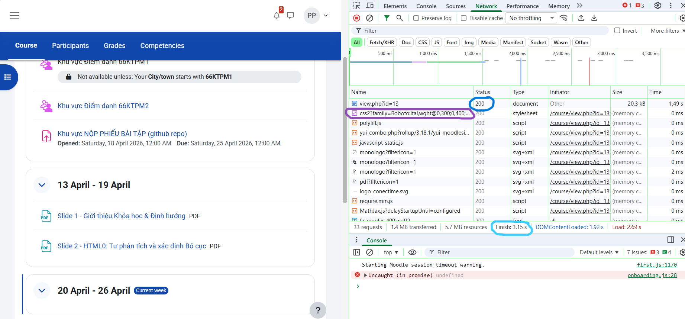

Câu A1 (5đ) — HTTP & Browser  

#### ****I. Khi gõ https://shopee.vn vào trình duyệt và nhấn Enter, các bước xảy ra (từ DNS lookup đến render).****
**1. DNS lookup**  
Trình duyệt hỏi DNS để chuyển shopee.vn → địa chỉ IP server.  
**2. Thiết lập kết nối TCP**  
Trình duyệt tạo kết nối tới server qua port 443 (HTTPS).  
**3. Bắt tay TLS (HTTPS)**  
Xác thực chứng chỉ, thiết lập mã hóa.  
**4. Gửi HTTP Request**  
Trình duyệt gửi request (GET /) lên server.  
**5. Server xử lý & trả Response**  
Server trả về HTML (kèm status code như 200 OK).  
**6. Trình duyệt parse HTML**  
Tạo DOM, phát hiện thêm tài nguyên (CSS, JS, ảnh…).  
**7. Tải tài nguyên phụ**  
Gửi thêm nhiều request để lấy CSS, JS, images.  
**8. Render trang**  
Kết hợp DOM + CSS → layout → paint → hiển thị trang.

#### II.Tab Network trong Chrome DevTools hiển thị gì?
Tab Network cho thấy toàn bộ hoạt động mạng của trang web:
- Danh sách tất cả request (HTML, CSS, JS, ảnh…)  
- Status Code (200, 404, 500…)  
- Time (thời gian tải từng request)  
- Waterfall (timeline tải)  
- Headers (request/response)  
- Size dữ liệu  
- Method (GET, POST…)  
**Ảnh chụp trang web:** 

Câu A2 (5đ) — Semantic HTML  
**Các lỗi semantic (ít nhất 4 lỗi)**

**Lỗi 1:** Dùng "div" thay cho thẻ semantic
header, menu, main, footer đều dùng "div"  
→ Google không hiểu đâu là header, nội dung chính, footer

**Lỗi 2: Menu không dùng danh sách nav + ul**  
Menu đang là nhiều "div"
→ Không đúng cấu trúc điều hướng

**Lỗi 3: Tiêu đề sản phẩm không dùng heading**  
"iPhone 16 Pro" dùng "div class="title"  
→ Phải là "h1", "h2" để Google hiểu nội dung quan trọng

**Lỗi 4: Ảnh không có alt**  
"img src="iphone.jpg"  
→ Thiếu alt → SEO rất kém (Google không hiểu ảnh)

Câu A3 (5đ) — Block vs Inline   
**Kết quả hiển thị của đoạn code HTML:**   
+------------------+    
| Hộp 1            |    
+------------------+

Text A Text B

+------------------+    
| Hộp 2            |    
+------------------+

Text C Text D

+------------------+    
| Hộp 3            |    
+------------------+

**Giải thích**
- Thẻ "div" là phần tử block nên thẻ "div" chiếm cả 1 dòng, phần tử sau sẽ xuống dòng.
- Thẻ "span" và "strong" là phần tử inline nên các thẻ "span" hoặc "strong" sẽ nằm cùng hàng nếu còn chỗ.

Câu A4 (5đ) — Table     
**Sự khác nhau giữa "thead", "tbody", "tfoot":**      
**thead:**  Chứa phần tiêu đề của bảng, thường gồm các cột tiêu đề "th".        
**tbody:**  Chứa nội dung chính của bảng, gồm các dòng dữ liệu "tr".        
**tfoot:**  Chứa phần chân bảng, thường dùng để hiển thị tổng kết, thống kê hoặc ghi chú.       
**KHÔNG NÊN dùng table để tạo layout trang web vì:**        
**1. Không đúng ngữ nghĩa (Semantic HTML):** 
table được thiết kế để hiển thị dữ liệu dạng bảng, không phải để bố trí giao diện.
Làm giảm khả năng hiểu cấu trúc trang của trình duyệt và công cụ tìm kiếm.      
**2. Khó bảo trì và chỉnh sửa:** 
Layout bằng table thường có nhiều hàng (tr) và cột (td) lồng nhau.
Khi thay đổi giao diện phải sửa nhiều mã HTML phức tạp.     
**3. Không responsive tốt:** 
Table khó thích nghi với các kích thước màn hình khác nhau.
Trên điện thoại dễ bị tràn nội dung hoặc phải cuộn ngang.       
**4. Hiệu năng kém hơn:** 
Trình duyệt phải tính toán toàn bộ cấu trúc bảng trước khi hiển thị.
Layout bằng CSS (Flexbox, Grid) hiển thị hiệu quả hơn.      
**5. Khó kiểm soát giao diện:**
Việc căn chỉnh vị trí, khoảng cách, thứ tự phần tử bằng table kém linh hoạt hơn CSS Flexbox hoặc CSS Grid.
